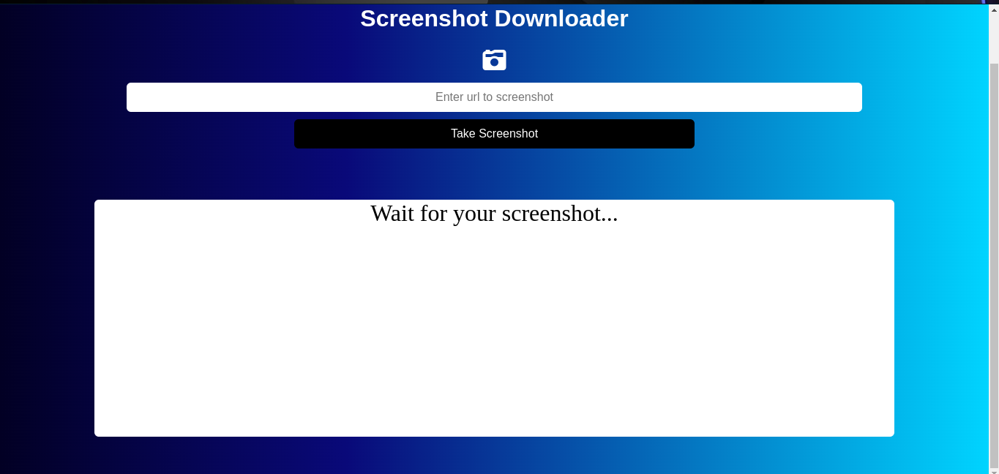

# screenshot_app
- [click me](https://screenshot-app-nu.vercel.app/)
# Screenshot App Documentation
## Introduction
- Welcome to our Screenshot App! This application enables users to capture screenshots of web pages by providing a URL. By leveraging a third-party API, the app seamlessly retrieves and displays screenshots, providing a user-friendly interface for quick and easy web captures.

## Table of Contents
- Getting Started
- Usage
- API integration
  
## Getting Started
- To get started with the Screenshot App, follow these steps:

## Clone the repository:
- `git clone git@github.com:Eric20Junior/screenshot_app.git`
- `cd screenshot_app`
- Go to `shot.screenshotapi.net` and get ur api key and input it in `script.js`

# Usage
## Open the Screenshot App in your browser.
- Copy the URL of the webpage you want to capture.
- Paste the URL into the provided input field.
- Click the "Take Screenshot" button.
- The app will communicate with the third-party API, capture the screenshot, and display the result.

## API Integration
- The Screenshot App integrates with a third-party API for capturing screenshots. Ensure that you have a valid API key from the screenshot provider. You can obtain one by signing up on their website.

